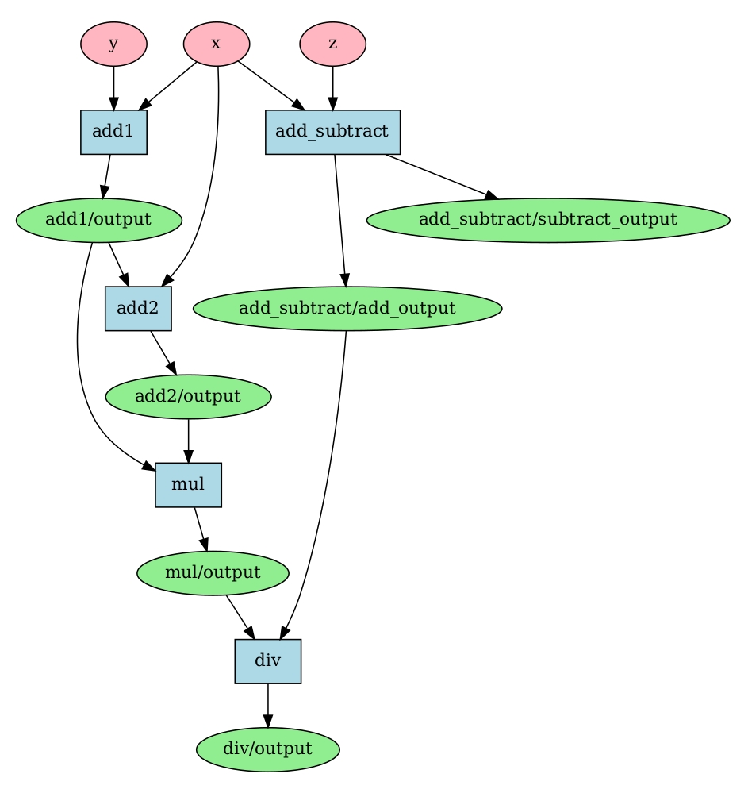

# Tiny DAG

Bare bones implementation of computation (directed, acyclic) graph for Python.

User provides graph structure (nodes) and input data for graph. Graph executes every node in graph and returns output 
of every node as the result.

# Requirements

- Python >= 3.6
- graphviz (optional)

# Installation

Install graphviz (optional, needed for rendering)
```
sudo apt-get install graphviz
```

Install tiny-dag
```
pip3 install tiny-dag
```

# Usage example

```
from tinydag.graph import Graph
from tinydag.node import Node

def add(a, b): return {"output": a + b}
def mul(a, b): return {"output": a * b}
def div(a, b): return {"output": a / b}
def add_subtract(a, b): return {"add_output": a + b, "subtract_output": a - b}

nodes = [
    Node(["add1/output", "x"], add, "add2", ["output"]),
    Node(["add1/output", "add2/output"], mul, "mul", ["output"]),
    Node(["x", "y"], add, "add1", ["output"]),
    Node(["x", "z"], add_subtract, "add_subtract", ["add_output", "subtract_output"]),
    Node(["mul/output", "add_subtract/add_output"], div, "div", ["output"]),
]

graph = Graph(nodes)
graph.render()

data = {"x": 5, "y": 3, "z": 3}
graph.check()
results = graph.calculate(data)
print(f"Result: {results}")
```

The results is dict of node outputs, in this case:

{'add1/output': 8, 
'add_subtract/add_output': 8, 
'add_subtract/subtract_output': 2, 
'add2/output': 13, 
'mul/output': 104, 
'div/output': 13.0}

render method produces following figure:
<p align="center">

</p>